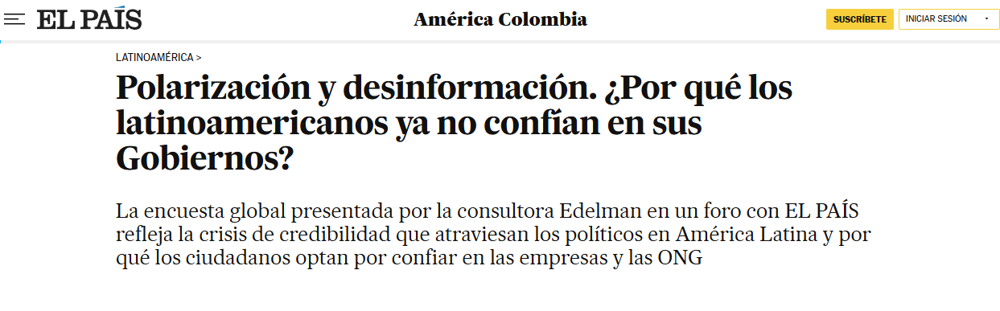
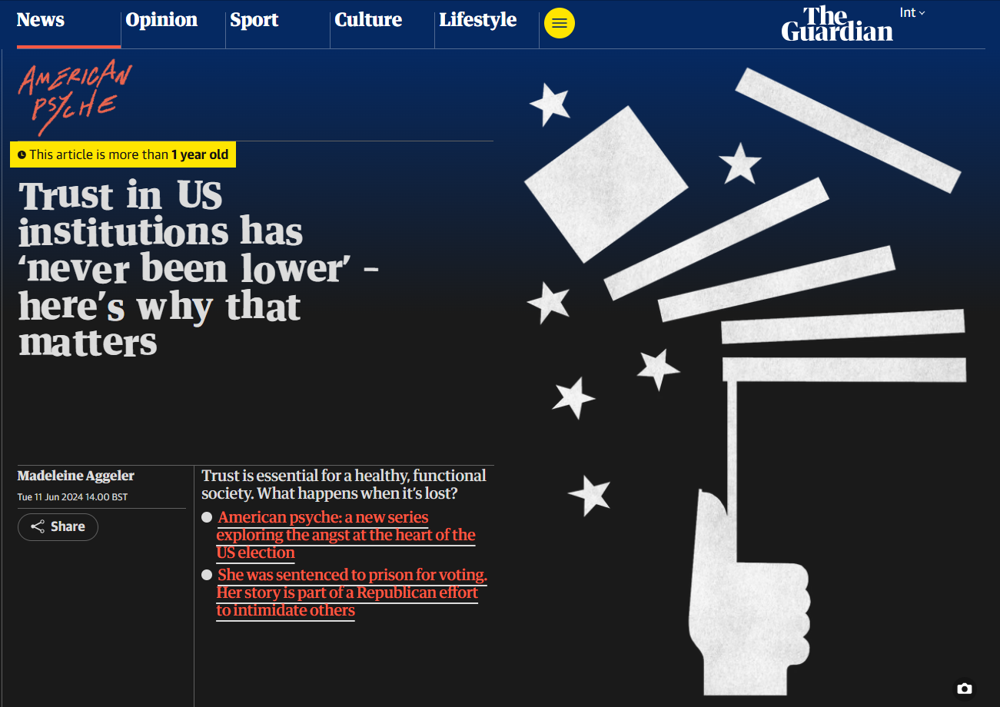

::: title-cover


<p class="title-cover">

<h1> Factores asociados a la confianza política:</h1>

</p>

<p class="cover-subtitle">

<h2><strong> Una aproximación empírica a partir del caso chileno</strong></h2>

</p>

<hr class="title-divider"/>

<p class="title-meta">

<strong>Juan Pablo Díaz</strong><br> Examen de Título Sociología <br> Comisión: Juan Carlos Castillo, Pablo Perez y Rodrigo Baño <br>  12 de enero de 2026  

</p>

:::


# Introducción {.antecedentes-grid}

## Contexto

{.fragment .absolute top=50 left=0 width="525" height="300"}

{.fragment .absolute top=50 right=0 width="525" height="300"}

{.fragment .absolute bottom=0 left=0 width="525" height="300"}

{.fragment .absolute bottom=0 right=0 width="525" height="300"}

# ¿Qué factores inciden en la construcción de los juicios de confianza política? {.antecedentes-grid}

## Confianza política: antecedentes

::: {.incremental style="font-size: 120%;"}

-  “...expectativa de que las instituciones políticas funcionen según reglas justas incluso en ausencia de escrutinio constante” [@marienMeasuringPoliticalTrust2013, p. 16][^1].

- Dos grupos de factores que explicarían su origen [@mishlerWhatAreOrigins2001; @vandermeerDeeplyRootedConcern2017; @zmerliPoliticalTrust2022]:

  - Institucional: evaluación racional del **desempeño institucional** en distintos ámbitos de interés. Desempeño económico, corrupción y distribución de ingresos.
  - Sociocultural: **conjunto de orientaciones valóricas y disposiciones** a cooperar con los otros según objetivos comunes. Tiene su pilar en la **confianza generalizada**.
  
  
[^1]: Traducción propia.

:::

## Problematización 
  
::: {.incremental  style="font-size: 125%;"}
  
  
- Conclusiones previas: la percepción del desempeño institucional **importaría más** para la confianza política que la confianza generalizada.

  a. Conciben la relación entre confianza generalizada y confianza política como un vínculo **exclusivamente** directo, ignorando su **potencial moderador**.  
  b. Se han construido sobre información de **sociedades de alta confianza generalizada**. Es posible encontrar un panorama diferente en **sociedades de baja confianza generalizada**.

:::

## El caso chileno

```{r}
#| label: fig-esquem1
#| fig-cap-location: top
#| fig-cap: "**Evolución de la confianza política en Chile: porcentaje de encuestados que reporta 'mucha' o 'algo' de confianza.**"
#| fig-align: center
#| fig-width: 8.5
#| out-width: '100%'


knitr::include_graphics(path = "C:/Users/jpdia/OneDrive/Documents/GitHub/tesis-final/tesis-pregrado/presentations/examen_titulo/graphs/graf_long.png") 

```

# ¿Cómo influyen la percepción del desempeño institucional y la confianza generalizada en la confianza política de los ciudadanos chilenos? {.antecedentes-grid}


## Percepción del desempeño institucional

::: {.incremental  style="font-size: 125%;"}


- **Desempeño económico**:  capacidad de incrementar los estándares de vida de la población [@thomassenSupportDemocraticValues1998; @mcallisterEconomicPerformanceGovernments1999; @quarantaDoesEconomyReally2016].
- **Corrupción**: capacidad de resguardar el principio de transparencia en el aparato público [@beesleyCorruptionInstitutionalTrust2022; @uslanerCorruptionInequalityTrap2013].
- **Justicia distributiva**: capacidad de asegurar una distribución de ingresos igualitaria, equitativa y suficiente. [@tylerSocialJustice2015; @zmerliIncomeInequalityDistributive2015].


:::

## Hipótesis

{.fragment .absolute top=125 left=200 height=400 width=600}


## Confianza generalizada

::: {.incremental  style="font-size: 120%;"}

- Confianza que se deposita sobre **la mayoría de la gente**. **Disposición moral** a confiar según el resto es parte de nuestra comunidad moral [@uslanerMoralFoundationsTrust2002].

- Lente a través del cual se interpreta el mundo de forma positiva, creyendo en la **buena voluntad** de los demás y cooperando con ellos [@oskarssonGeneralizedTrustPolitical2010].

- Quienes confían en los otros serían **menos sensibles a disminuir su confianza política** en función de una evaluación negativa de su desempeño al corto plazo.

:::

## Hipótesis

{.fragment .absolute top=125 left=200 height=400 width=600}

## Particularidades del caso chileno

::: {.incremental  style="font-size: 120%"}

- Baja confianza política convive con **mejoras** en indicadores económicos, baja corrupción y disminución de la desigualdad.

- Explicación complementaria: 
  - **Baja confianza generalizada**: Solo un 15% de los chilenos dice confiar en los demás [@pnudInformeSobreDesarrollo2024].
  
- *H8*: en Chile, la confianza generalizada presenta una asociación con la confianza política **de mayor magnitud** que la percepción del desempeño institucional. 

:::

# Estrategia de análisis {.antecedentes-grid}


## Metodología

::: {.incremental  style="font-size: 125%;"}

- **Encuesta Latinobarómetro 2024**. Muestra de 1200 entrevistados. Probabilistica en tres etapas. Representativa del 100% de la población adulta urbana. 944 observaciones utilizadas para el análisis (sin *NA* ni observaciones influyentes).

- Análisis transversal: caracter exploratorio del estudio.

- Para los análisis, se construyeron un total de seis **modelos de regresión lineal (MCO)** siguiendo una estrategia incremental. 

:::

## Variables principales


| **Variables**                                    | Media (de); n (%)   | 
|--------------------------------------------------|:---------------:|
| **Indice de confianza política ($\alpha$ = 0.82)** | 53.43 (1.87)      |
| **Indice de percepción del desempeño económico ($\alpha$ = 0.80)** | 5.15 (1.86)                |  
| **Progreso en reducir la corrupción**                       |     -          | 
| Poco/Nada                                                |  612 (64.8%)            |
| Mucho/Algo                                               | 332 (35.2%) |
| **Justicia en la distribución de ingresos**              | -           |
| Injusta/Muy injusta                                      | 865 (91.6%) |
| Muy justa/Justa                                          | 79 (8.4%) |
| **Confianza generalizada**                               |      -       |
| Uno nunca es lo suficientemente cuidadoso en el trato con los demás | 786 (83.3%) |
| Se puede confiar en la mayoría de las personas           | 158 (16.7%) |


# Resultados {.antecedentes-grid}

## Bivariados: situación económica y confianza política

```{r}
#| label: fig-esquem3
#| fig-cap-location: top
#| fig-cap: "**Gráfico de dispersión suavisado: situación económica y confianza política**"
#| fig-align: center
#| fig-width: 8.5
#| out-width: '100%'


knitr::include_graphics(path = "C:/Users/jpdia/OneDrive/Documents/GitHub/tesis-final/tesis-pregrado/presentations/examen_titulo/graphs/graf_sitecon.png")

```


## Bivariados: progreso en reducir corrupción y confianza política

```{r}
#| label: fig-esquem4
#| fig-cap-location: top
#| fig-cap: "**Gráfico de barras: corrupción y confianza política"
#| fig-align: center
#| fig-width: 8.5
#| out-width: '100%'


knitr::include_graphics(path = "C:/Users/jpdia/OneDrive/Documents/GitHub/tesis-final/tesis-pregrado/presentations/examen_titulo/graphs/graf_corrup.png")

```


## Bivariados: justicia distributiva y confianza política


```{r}
#| label: fig-esquem5
#| fig-cap-location: top
#| fig-cap: "**Gráfico de barras: justicia distributiva y confianza política**"
#| fig-align: center
#| fig-width: 8.5
#| out-width: '100%'


knitr::include_graphics(path = "C:/Users/jpdia/OneDrive/Documents/GitHub/tesis-final/tesis-pregrado/presentations/examen_titulo/graphs/graf_justdist.png")

```


## Bivariados: confianza generalizada y confianza política

```{r}
#| label: fig-esquem6
#| fig-cap-location: top
#| fig-cap: "**Gráfico de barras: confianza generalizada y confianza política**"
#| fig-align: center
#| fig-width: 8.5
#| out-width: '100%'


knitr::include_graphics(path = "C:/Users/jpdia/OneDrive/Documents/GitHub/tesis-final/tesis-pregrado/presentations/examen_titulo/graphs/graf_confgen.png")

```

## Resultados regresiones

```{r}
#| label: fig-esquem7
#| fig-cap-location: top
#| fig-cap: "**Gráfico coeficientes modelos 3, 4 y 6**"
#| fig-align: center
#| fig-width: 8.5
#| out-width: '100%'


knitr::include_graphics(path = "C:/Users/jpdia/OneDrive/Documents/GitHub/tesis-final/tesis-pregrado/presentations/examen_titulo/graphs/coeficientes.png")

```


# Discusión { .antecedentes-grid}

## Primer hallazgo

::: {.incremental  style="font-size: 125%;"}

1. Las tres variables de percepción del desempeño se **relacionan positivamente con la confianza política** (*H1*, *H2* y *H3*). La corrupción y la justicia distributiva inciden más que el desempeño económico.  
    i) Escándalos de corrupción pública [@lunaDelegativeDemocracyRevisited2016a].
    ii) Politización de las desigualdades [@castiglioniChallengesPoliticalRepresentation2016].
    
:::

## Segundo hallazgo

::: {.incremental  style="font-size: 125%;"}

2. La confianza generalizada presenta una relación positiva con la confianza política (*H4*). A su vez, **modera positivamente** la relación que el desempeño económico y la justicia distributiva tienen con la confianza política (*H5* y *H7*).
    i) Ideal igualitario asociado a la confianza generalizada [@uslanerMoralFoundationsTrust2002].
    ii) Malos desempeños --> distanciamiento del ideal.
    iii) ¿Y la corrupción?

:::  

## Tercer hallazgo

::: {.incremental  style="font-size: 125%;"}

3. La confianza generalizada **importa tanto o más** que la percepción del desempeño en la construcción de los juicios de confianza política de los chilenos (*H8*). 
    i) Progresiva erosión del tejido social. Circuito de desapego que convierte la sociedad chilena en una "sociedad archipiélago" [@araujoCircuitoDesapegoNeoliberalismo2025a].
    ii) Dificultad para generar las normas de reciprocidad y colaboración asociadas a una mayor confianza en las instituciones [@uslanerDemocracySocialCapital1999; @zmerliSocialTrustAttitudes2008].

:::

# Conclusiones {.slide-celeste}

::: {.incremental  style="font-size: 125%;"}

- **Más allá de la dicotomía**: la confianza política es un **fenómeno complejo**, en cuya construcción inciden tanto la evaluación racional del desempeño como la disposición moral a confiar en los demás.

- **Más allá del vínculo directo**: es necesario prestar atención al **efecto moderador** de la confianza generalizada.

- **Mas allá de Europa y EEUU**: en sociedades de baja confianza generalizada, este atributo puede tener una **mayor importancia relativa**.

:::

# Comentarios profesor lector {.slide-celeste}

::: {.incremental  style="font-size: 125%;"}

- Definiciones y justificaciones en la **introducción**.

- Justificación mecanismo detrás del supuesto **efecto moderador negativo** de la confianza generalizada.

- Incluir **Análisis Factorial Exploratorio.**

:::

# ¡Gracias por su atención! 


-   **Github del proyecto:** <https://github.com/jp-diaz-c/tesis-final> 

## Referencias

::: {#refs}
:::

## Apéndice 1: AFE confianza poliítca.

::: {style="font-size: 125%;"}

Variable  |  MR1 | Complexity | Uniqueness
----------|------|-------------|------------
Confianza en el congreso | 0.84 |       1.00 |       0.29
Confianza en el gobierno  | 0.55 |       1.00 |       0.70
Confianza en el poder judicial | 0.75 |       1.00 |       0.44
Confianza en los partidos políticos | 0.83 |       1.00 |       0.31

:::

## Apéndice 2: AFE desempeño económico.

::: {style="font-size: 125%;"}

Variable  |  MR1 | Complexity | Uniqueness
----------|------|-------------|------------
Situación económica actual | 0.70 |       1.00 |       0.51
Situación económica pasada | 0.84 |       1.00 |       0.29
Situación económica futura | 0.74 |       1.00 |       0.45


:::

## Apéndice 3: Tablas de regresión sin interacción


```{r}
#| echo: false
#| results: asis

library(sjPlot)

mod1 <- readRDS("C:/Users/jpdia/OneDrive/Documents/GitHub/tesis-final/tesis-pregrado/IPO/input/proc/desempeño_simple.rds")
mod2 <- readRDS("C:/Users/jpdia/OneDrive/Documents/GitHub/tesis-final/tesis-pregrado/IPO/input/proc/desempeño_confianza_simple.rds")
mod3 <- readRDS("C:/Users/jpdia/OneDrive/Documents/GitHub/tesis-final/tesis-pregrado/IPO/input/proc/desempeño_confianza_multiple.rds")


nombres_modelos <-  c("Perc. situación económica nacional", "Progreso en corrupción", "Justicia distributiva", "Conf. generalizada")


vars_to_show <- c("perc_sitecon", "reduc_corrup_rec", "just_distr_rec", "conf_gen_rec") 


sjPlot::tab_model(list(mod1, mod2, mod3), terms = vars_to_show, show.ci = FALSE, p.style = "stars",  dv.labels = c("Modelo 1", "Modelo 2", "Modelo 3"), string.pred = "Predictores", string.est = "beta", show.se = TRUE, string.se = "se", pred.labels = nombres_modelos, title = "", file = NULL)


```


## Apéndice 4: Tablas de regresión con interacción


```{r}
#| echo: false
#| results: asis


mod4 <- readRDS("C:/Users/jpdia/OneDrive/Documents/GitHub/tesis-final/tesis-pregrado/IPO/input/proc/inter1.rds")
mod5 <- readRDS("C:/Users/jpdia/OneDrive/Documents/GitHub/tesis-final/tesis-pregrado/IPO/input/proc/inter2.rds")
mod6 <- readRDS("C:/Users/jpdia/OneDrive/Documents/GitHub/tesis-final/tesis-pregrado/IPO/input/proc/inter3.rds")


nombres_inter <-  c("Perc. situación económica nacional X Conf. generalizada", "Prog. corrupción x Conf. generalizada", "Just. distributiva X Conf. generalizada")


vars_inter <- c("perc_sitecon:conf_gen_rec", "reduc_corrup_rec:conf_gen_rec", "just_distr_rec:conf_gen_rec") 


sjPlot::tab_model(list(mod4, mod5, mod6), terms = vars_inter, show.ci = FALSE, p.style = "stars",  dv.labels = c("Modelo 4", "Modelo 5", "Modelo 6"), string.pred = "Predictores", string.est = "beta", show.se = TRUE, string.se = "se", pred.labels = nombres_inter, title = "", file = NULL)


```


## Apéndice 5: Controles Modelo 3


```{r}
#| echo: false
#| results: asis


nombres_control <-  c("Sexo", "Edad", "Religión: Católico", "Religión: No católico", "Universitario", "ESS: Clase Media", "ESS: Clase Alta/Media alta")


vars_control <- c("sexo_mujer", "edad", "religion2", "religion3", "nivel_educ_rec", "estatus_subj2", "estatus_subj3") 

sjPlot::tab_model(mod3, terms = vars_control,  show.ci = FALSE, p.style = "stars",  dv.labels = c("Modelo 3"), string.pred = "Predictores", string.est = "beta", show.se = TRUE, string.se = "se", pred.labels = nombres_control, title = "", file = NULL)


```

## Apendice 6: relevancia confianza política

::: {.incremental  style="font-size: 125%;"}

- "En particular, los académicos suelen asumir que los ciudadanos desencantados son más propensos a **impulsar cambios radicales** en el sistema..."[@andersonSensitiveLeftImpervious2008, p.572] [^2]. 

- "La afirmación fundamental es que las personas no estarán dispuestas a apoyar políticas que impliquen **riesgos o sacrificios personales** si no confían en el gobierno." [@citrinPoliticalTrustCynical2018, p. 61].

- "La confianza política... **reduce la evasión fiscal**, facilita el **consentimiento de los perdedores políticos** y ayuda a allanar el camino hacia el acuerdo político y el compromiso" [@newtonSocialPoliticalTrust2017, p. 38].

[^2]: Traducción y énfasis propio.

:::

## Distinciones confianza política

::: {.incremental  style="font-size: 125%;"}


- Indicador intermedio de **apoyo político**, dirigido a las instituciones políticas del régimen [@monterogibertConfianzaSocialConfianza2008; @zmerliPoliticalTrust2022].

:::

## Regresiones con interacción: perc. situación económica X confianza generalizada


```{r}
#| label: fig-esquem8
#| fig-cap-location: top
#| fig-cap: "**Gráfico interacción justicia distributiva con confianza generalizada**"
#| fig-align: center
#| fig-width: 8.5
#| out-width: '100%'


knitr::include_graphics(path = "C:/Users/jpdia/OneDrive/Documents/GitHub/tesis-final/tesis-pregrado/presentations/examen_titulo/graphs/interaccion_sitecon-p.png")

```


## Regresiones con interacción: justicia distributiva X confianza generalizada

```{r}
#| label: fig-esquem9
#| fig-cap-location: top
#| fig-cap: "**Gráfico interacción justicia distributiva con confianza generalizada**"
#| fig-align: center
#| fig-width: 8.5
#| out-width: '100%'


knitr::include_graphics(path = "C:/Users/jpdia/OneDrive/Documents/GitHub/tesis-final/tesis-pregrado/presentations/examen_titulo/graphs/interaccion_justdist-p.png")

```

# Proyecciones {.slide-celeste}

::: {.incremental  style="font-size: 125%;"}

- Llevar a cabo modelos de tipo multinivel sobre **datos longitudinales** para analizar cómo estos efectos varían en el tiempo (si es que lo hacen).

- Incluir **variables contextuales** y compararlas con las de percepción.

- Expandir el radio de estudio hacia **mas países** de la región. 

:::

## El caso chileno: comparado

```{r}
#| label: fig-esquem2
#| fig-cap-location: top
#| fig-cap: "**Confianza política comparada en América Latina: promedio de confianza política.**"
#| fig-align: center
#| fig-width: 8.5
#| out-width: '100%'


knitr::include_graphics(path = "C:/Users/jpdia/OneDrive/Documents/GitHub/tesis-final/tesis-pregrado/presentations/examen_titulo/graphs/graf_pais.png") 

```


